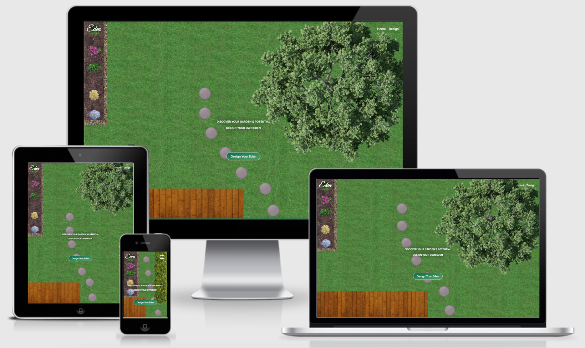

# Eden

View the live project [here](https://darraghreid.github.io/eden/)

This website was created for Code Institute's Milestone 2 Project as part of the Diploma in Full Stack Web Development. 
The purpose of this project is to demonstrate the student's knowledge and skills acquired thus far in the course. 
This includes skills in HTML, CSS, JavaScript as well as other User Centric Design skills as outlined in the [Technologies Used](#Technologies-Used) section.
This project marks my first time writing JavaScript.

The purpose of this site is to be a platform on which users can design gardens. The idea was given to me by landscape gardening student who expressed a desire
for an application on which he could design gardens in front of customers in real time. I decided to create [Eden](https://darraghreid.github.io/eden/) with him
in mind as the site owner where both he and potential customers could use this software to experiment with their ideas.

## User Experience (UX)
* User Stories
    * First Time User Goals: 
        1. As a first time user, I want to immediately understand the purpose of the site.
        2. As a first time user, I want to be able to easily navigate through the site to find what I'm looking for.
        3. As a first time user, I want to instinctively know what to do in order to get started on designing my garden.
        4. As a first time user, I want to have a selection of different garden elements to experiment with.
        5. As a first time user, I want to be able select and manipulate different garden elements in order to create my own design.
        6. As a first time user, I want to have the choice of adding and removing different garden elements from my design.
        7. As a first time user, I want to be able to move and resize different garden elements.

    * Returning User Goals:
        1. As a returning user, I want to be immediately familiar with the layout of the site.
        2. As a returning user, I want to be able to make new designs.

    * Site Owner Goals:
        1. As the site owner, I want to be able to design gardens in real time for potential customers.
        2. As the site owner, I want potential customers and general users to be able to design their own gardens and express their own ideas.
        3. As the site owner, I want to have a selection of garden elements so both I and users can create varying designs.
        4. As the site owner, I want the garden elements to be able to be manipulated in size and position so both I and the user can create designs with ease.
        5. As the site owner, I want the site to be simple, intuitive, and user-friendly.
        6. As the site owner, I want the design of the site the reflect its purpose.

## Structure
The site is designed as a single webpage with two sections; the Home Page and the Studio.
Both sections are linked to in the navigation bar in the home page, as well as in other links throughout the sections.
This makes it so each section is never more than a click away and results in fast and intuitive navigation.

## Design
* Colour Scheme
    * The colours used in this project are rgb(0, 105, 78), rgb(68, 153, 94), rgb(201, 197, 197), and white. I found that these shades of green
    represented the garden design ethos of the site well, while the white offered a good contrast to the text. I also found that the light grey 
    provided a sufficient dulling effect to the clickable text while hovered over.

* Typeography
    * The fonts used throughout the site are Roboto and Great Vibes.
    Great Vibes is a cursive font and gives an elegent appearance to the logo.
    Roboto is used in all other instances and works well with the font of the logo.

* Imagery
    * All images were sourced from websites which provide images for free.
    These websites are listed below along with the images that were sourced from them:
        * https://www.pngjoy.com/
            * https://www.pngjoy.com/preview/w3z5l3p1l6j9b4_palm-palm-tree-top-view-png-hd-png/ (photographer unnamed)
            * https://www.pngjoy.com/preview/u9f1d4c1b0f6v1_hanging-plants-scientific-names-of-plants-animals-and/ (photographer unnamed)
            * https://www.pngjoy.com/preview/u5r5n3a6e7k8f7_white-rose-white-and-yellow-roses-png-transparent/ (photographer unnamed)
            * https://www.pngjoy.com/preview/f2k8p5x5a2p7j0_flower-crown-png-tumblr-white-flower-crown-transpa/ (photographer unnamed)
            * https://www.pngjoy.com/preview/z7m2e9e9x6z4h5_stone-path-nail-polish-transparent-png/ (photographer unnamed)
            * https://www.pngjoy.com/preview/z1l9n7s4a8p6r8_bush-bush-png-transparent-png/ (photographer unnamed)
            * https://www.pngjoy.com/preview/x1k3u4f2u0q7r8_tree-top-mango-tree-top-view-transparent-png/ (photographer unnamed)
            * https://www.pngjoy.com/preview/m5y3d1u8d3q6r2_bush-bushes-png-png-download/ (photographer unnamed)
            * https://www.pngjoy.com/preview/f3t5j5r2f9h7g0_tree-plan-fruit-tree-top-view-png-png/ (photographer unnamed)
            
        * https://www.freeimages.com/
            * https://www.freeimages.com/photo/grass-1508240 (photographer: Philipp Pilz)
            * https://www.freeimages.com/photo/fresh-soil-1468423 (photographer: Mike Berg)
            * https://www.freeimages.com/photo/old-wood-texture-1154441 (photographer: Petr Kovar)
            
        * https://pixabay.com/
            * https://pixabay.com/photos/pebbles-decking-texture-model-3212192/ (photographer: _Alicja_)
            * https://pixabay.com/photos/flower-tropical-bougainvillea-3271195/ (photographer: Buntysmum)
    
    * Some images were edited by the developer to suit the needs of the site. The images that were edited include:
        * grass-2.png was edited from https://www.freeimages.com/photo/grass-1508240 (photographer: Philipp Pilz)
        * gravel-4.png was edited from https://pixabay.com/photos/pebbles-decking-texture-model-3212192/ (photographer: _Alicja_)
        * soil-1.png was edited from https://www.freeimages.com/photo/fresh-soil-1468423 (photographer: Mike Berg)

    These images were edited by cutting and pasting different parts of the images to create a larger image using [Google Slides](https://www.google.com/slides/about/)
    
    * It was important to find png images without any backgrounds in order for users to seemlessly place images on top of one another
    to give the impression that the garden elements are real.