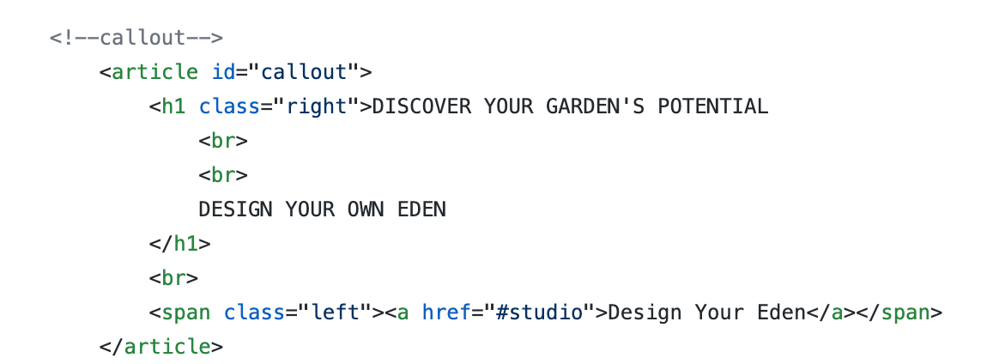
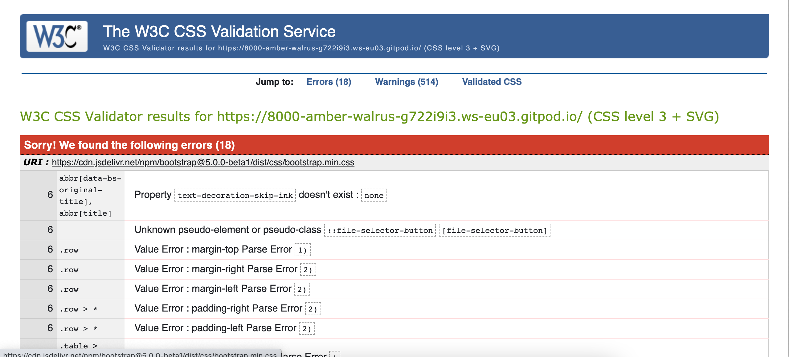

# Eden

View the live project [here](https://darraghreid.github.io/eden/)

This website was created for Code Institute's Milestone 2 Project as part of the Diploma in Full Stack Web Development. 
The purpose of this project is to demonstrate the student's knowledge and skills acquired thus far in the course. 
This includes skills in HTML, CSS, JavaScript as well as other User Centric Design skills as outlined in the [Technologies Used](#Technologies-Used) section.
This project marks my first time writing JavaScript.

The purpose of this site is to be a platform on which users can experiment with garden designs. The idea was given to me by landscape gardening student who expressed a desire
for an application on which he could make rough garden designs in front of customers in real time. I decided to create [Eden](https://darraghreid.github.io/eden/) with him
in mind as the site owner where both he and potential customers could use this software to experiment with their ideas.

## User Experience (UX)
* User Stories
    * First Time User Goals: 
        1. As a first time user, I want to immediately understand the purpose of the site.
        2. As a first time user, I want to be able to easily navigate through the site to find what I'm looking for.
        3. As a first time user, I want to instinctively know what to do in order to get started on designing my garden.
        4. As a first time user, I want to have a selection of different garden elements to experiment with.
        5. As a first time user, I want to be able select and manipulate different garden elements in order to create my own design.
        6. As a first time user, I want to have the choice of adding and removing different garden elements from my design.
        7. As a first time user, I want to be able to move and resize different garden elements.

    * Returning User Goals:
        1. As a returning user, I want to be immediately familiar with the layout of the site.
        2. As a returning user, I want to be able to make new designs.

    * Site Owner Goals:
        1. As the site owner, I want to be able to design gardens in real time for potential customers.
        2. As the site owner, I want potential customers to be able to design their own gardens and express their own ideas.
        3. As the site owner, I want to have a selection of garden elements so both I and users can create varying designs.
        4. As the site owner, I want the garden elements to be able to be manipulated in size and position so both I and the user can create designs with ease.
        5. As the site owner, I want the site to be simple, intuitive, and user-friendly.
        6. As the site owner, I want the design of the site the reflect its purpose.

## Structure
The site is designed as a single webpage with two sections; the Home Page and the Studio.
Both sections are linked to in the navigation bar in the home page, as well as in other links throughout the sections.
This makes it so each section is never more than a click away and results in fast and intuitive navigation.

## Design
* Colour Scheme
    * The colours used in this project are rgb(0, 105, 78), rgb(68, 153, 94), rgb(201, 197, 197), and white. I found that these shades of green
    represented the garden design ethos of the site well, while the white offered a good contrast to the text. I also found that the light grey 
    provided a sufficient dulling effect to the clickable text while hovered over.

        I chose the colour palette using [coolers.co](https://coolors.co/)

    

* Typeography
    * The fonts used throughout the site are Roboto and Great Vibes.
    Great Vibes is a cursive font and gives an elegent appearance to the logo.
    Roboto is used in all other instances and works well with the font of the logo.

        The fonts were chosen from [Google Fonts](https://fonts.google.com/)

* Imagery
    * All images were sourced from websites which provide images for free.
    These websites are listed below along with the images that were sourced from them 
    as well as photgrapher details (where applicable):
        * [pngjoy.com](https://www.pngjoy.com/)
            * https://www.pngjoy.com/preview/w3z5l3p1l6j9b4_palm-palm-tree-top-view-png-hd-png/ (photographer unnamed)
            * https://www.pngjoy.com/preview/u9f1d4c1b0f6v1_hanging-plants-scientific-names-of-plants-animals-and/ (photographer unnamed)
            * https://www.pngjoy.com/preview/u5r5n3a6e7k8f7_white-rose-white-and-yellow-roses-png-transparent/ (photographer unnamed)
            * https://www.pngjoy.com/preview/f2k8p5x5a2p7j0_flower-crown-png-tumblr-white-flower-crown-transpa/ (photographer unnamed)
            * https://www.pngjoy.com/preview/z7m2e9e9x6z4h5_stone-path-nail-polish-transparent-png/ (photographer unnamed)
            * https://www.pngjoy.com/preview/z1l9n7s4a8p6r8_bush-bush-png-transparent-png/ (photographer unnamed)
            * https://www.pngjoy.com/preview/x1k3u4f2u0q7r8_tree-top-mango-tree-top-view-transparent-png/ (photographer unnamed)
            * https://www.pngjoy.com/preview/m5y3d1u8d3q6r2_bush-bushes-png-png-download/ (photographer unnamed)
            * https://www.pngjoy.com/preview/f3t5j5r2f9h7g0_tree-plan-fruit-tree-top-view-png-png/ (photographer unnamed)
            
        * [freeimages.com](https://www.freeimages.com/)
            * https://www.freeimages.com/photo/grass-1508240 (photographer: Philipp Pilz)
            * https://www.freeimages.com/photo/fresh-soil-1468423 (photographer: Mike Berg)
            * https://www.freeimages.com/photo/old-wood-texture-1154441 (photographer: Petr Kovar)
            
        * [pixaboy.com](https://pixabay.com/)
            * https://pixabay.com/photos/pebbles-decking-texture-model-3212192/ (photographer: _Alicja_)
            * https://pixabay.com/photos/flower-tropical-bougainvillea-3271195/ (photographer: Buntysmum)
    
    * Some images were edited by the developer to suit the needs of the site. The images that were edited include:
        * grass-2.png was edited from https://www.freeimages.com/photo/grass-1508240 (photographer: Philipp Pilz)
        * gravel-4.png was edited from https://pixabay.com/photos/pebbles-decking-texture-model-3212192/ (photographer: _Alicja_)
        * soil-1.png was edited from https://www.freeimages.com/photo/fresh-soil-1468423 (photographer: Mike Berg)

    These images were edited by cutting and pasting different parts of the images to create a larger image using [Google Slides](https://www.google.com/slides/about/)
    
    * It was important to find png images without any backgrounds in order for users to seemlessly place images on top of one another
    to give the impression that the garden elements are real.

## Wireframes
* Wireframe of Home Page

* Wireframe of Studio

* Wireframe of Tutorial Section (Not included in final product)

### Difference between wireframes and final product
* The most obvious differnce between the wireframes and the final product is that the Tutorial section in the final product.
I had originally planned to record a tutorial of how to use the software. Upon completion of the software, however, I found that
it was intuitive enough that a tutorial was not required. 

I feel a tutorial section would have been of no benefit to the product and would not have contributed to the requirements set out 
in the Assessment Handbook.

This ommision had a minor impact on the Home Page where the "Watch Tutorial" call-to-action button and the "Tutorial" link 
in the navbar are not present in the final product.

* Another difference between the wireframe and the final product is the menu in the Studio section. The wireframe displays a 
text-based menu where each menu item would have a drop down menu of related images of garden elements.

I felt it was more intuitive to lead with images rather than text. I felt that this is more in line with modern design software
such as Balsamiq, for example.

The text is only present when the user hovers over the image-based menu item.

* Finally, I chose to omit the social links from the footer as they would have served no purpose to the site and would not have 
contributed to the requirements set out in the Assessment Handbook.

## Features
* Home Page
The Home Page is where the user is introduced to the site an takes up 100vh.
    * The Home Page includes a responsive Bootstrap navbar disaplying the logo as well as links to the two sections of the site.
    These links collapse into a dropdown button on smaller screens. The button that is seen on smaller screens is represented 
    by a fontawesome icon, as the original button was having trouble displaying.

    These links, along with all clickable links throughout the site, highlight upon hover.

    * The main feature of the Home Page is the background image of a garden that gradually builds itself on page load.
    The scene is comprised of multiple good resolution images. Therefore, when the site is first loaded (without cache),
    the images may not have fully loaded by the time they are brought onto the screen. However, this transition effect is 
    seemless upon further reloads.

    The self-building image of a garden was designed with user intuition in mind. The user should immediately understand the 
    purpose of the site upon seeing it. It is designed to be an exciting introduction to the Eden site.

    The garden scene is also responsive. The images change change in size and position depending on the screen size. On particularly
    small screens, the tree is replaced with a bush.

    NOTE: Each image in the garden scene has a different CSS transition period. Therefore, when resizing in Dev Tools,
    allow a few seconds for each image to transition to its appropriate size and position.

    * The callout, which along with the call-to-action button, is brought on screen by the transition mentioned above, 
    provides further affirmation as to the purpose of the site.

    * The call-to-action button brings the user straight to the Studio section where they can immediately begin designing.

* Studio Section
The Studio section is where users can design their gardens. It takes up 90vh, with the remaining 10vh being occupied by the footer.
    * At the very top of the Studio section is the header which introduces and concisely details the purpose of the section.
    * Beneath the header is a visually appealing, scrollable, image-based menu comprised of images of each of the garden elements
    available for the user to experiment with.

        This menu was designed to be intuitive for the user. The user should immediately understand that these images are clickable.
        Once clicked, the image displayed on that menu item should appear on the canvas below, ready to be manipulated.

        The menu is resonsive. On larger screens the menu items are centered within the menu section. On smaller screens, it is 
        laterally scrollable.

        This menu was inpired by a [w3schools](https://www.w3schools.com/howto/tryit.asp?filename=tryhow_css_menu_hor_scroll) scrollable
        menu, which underwent a good deal of editing due to significant differences in the site menu and the w3School example.

        Aside from all classes and ids being renamed, there are major structural differences. For example, the w3schools example is simply
        a list of anchor tags. Each menu item in the Studio section of Eden is comprised of four different elements including a two divs,
        and anchor tag, an image, and a paragraph tag. This required significantly more editing in style.css.

    * The canvas section of the Studio is where users can manipulate the various garden elements that they have selected from the 
    menu above. Each element that appears on the canvas is removable, moveable, and resizable. This allows the user to be 
    creative in their designs. The canvas section has an overflow of hidden, thus the images cannot be moved onto other section of the site.

* Footer
The footer occupies the remaining 10vh and is comprised of two links, the Logo, and a back-to-top link, which encompasses an "up" fontawesome
arrow icon. These links are located and the left and right of the footer, respectively. Both links lead to the Home Page.

### Potential Future Features
Although the initial goal of creating a platform on which users can create rough garden designs has been achieved, a few possible additional features 
that could be implemented in future versions of the site came to mind throughout the creation process. These include:
    * A larger selection of garden elements. These would, of course, be subject to the site owners preferences.
    * The ability of the user to rotate images. This would be useful for rectangular elements, such as bushes.
    * The ability of the user to crop images.
    * The ability of the user to increase or decrease the z-index of the elements.
    * The ability of the user to save their work. This could possibly involve the creation of an account.
    * The ability of the user to shape their garden to suit their preference.

## Technologies Used 

### Languages Used 
* [HTML5](https://en.wikipedia.org/wiki/HTML5)
* [CSS3](https://en.wikipedia.org/wiki/CSS)
* [JavaScript](https://en.wikipedia.org/wiki/JavaScript)

### Frameworks, Libraries & Programs Used
* [Balsamiq](https://balsamiq.com/)
    * Balsamiq was used to make the wireframes for the project

* [Bootstrap 5.0.0](https://getbootstrap.com/docs/5.0/getting-started/introduction/)
    * Bootstrap was used in conjunction with [jQuery](https://jquery.com/) on the Navbar to make it responsive and to collapse the menu items into a single button at smaller screen sizes.  

* [Font Awesome](https://fontawesome.com/)
    * As mentioned in the [features](#features) section, the dropdown menu button in the navbar is represented by a fontawesome icon.
    There is also a fontawesome icon used in the "back to top" link in the footer.
    
* [Git](https://git-scm.com/)
    * The Gitpod terminal was used to commit to Git and push to Github.

* [GitHub](https://github.com/)
    * Github was used to store the code from the project.

* [Google Fonts](https://fonts.google.com/)
    * The two fonts used in the project (Roboto and Great Vibes) were imported from Google Fonts.

* [jQuery](https://jquery.com/)
    * jQuery was used in conjuction with Boostrap on the Navbar.

### Other Technologies
* [babel](https://babeljs.io/) compiler was used while trouble-shooting a bug where the site functionality wouldn't work on
Apple devices. I used babel to convert my JavaScript code ES5. This was unsuccessful in solving the issue, and the ES5 code 
was ultimately removed.

* [Autoprefixer](http://autoprefixer.github.io/) was used for the same reason as babel. I used Autoprefixer to add vendor 
prefixes to make it more compatible with various browsers and devices. It was also unsuccessful in addressingthe bug. However, 
I opted to keep the prefixes as I felt they would be beneficial to the site.

## Testing
The [W3C Markup Validator](https://validator.w3.org/) and [W3C CSS Validator Services](https://jigsaw.w3.org/css-validator/) 
were used to validate this project's code and to make sure there were no syntax errors in the project.

W3C Markup Validator 

Two warnings arose from the W3C validator:

* Starting with the second warning; it stated that the <section> element with the id "home-screen" lacked a heading. 
It doesn't seem to recognise that the <h1> callout is the heading for this section. This may be beacause I opted to 
implement the background garden images before I wrote and positioned the callout in the foreground.

* Relating to the second warning, the first warning suggested that the callout was not an appropriate use of a <h1> tag.
However, this is the most important, indeed, the only, heading on the Home Page.

I figured the issue lay in the fact that I had enclosed the callout in <article> tags. 

I changed the <article> tags to 
 tags ran the site through the validator again. It passed with no issues.

W3C CSS Validator 

### Testing User Stories from User Experience (UX) Section