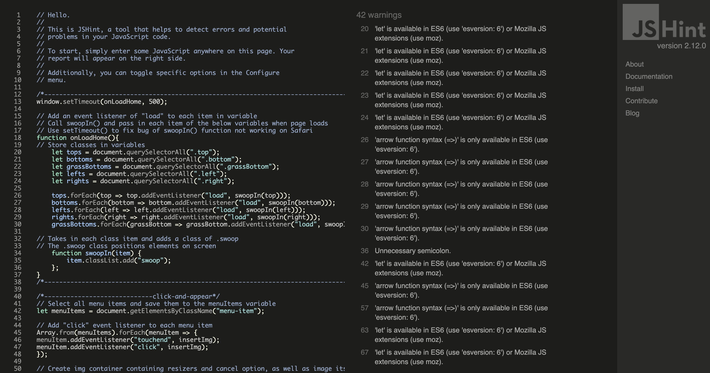
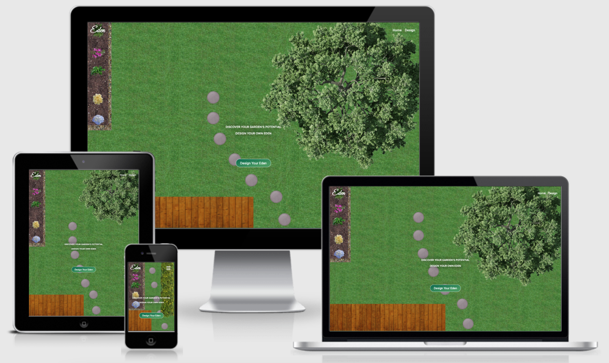

# Testing
The [W3C Markup Validator](https://validator.w3.org/), the [W3C CSS Validator Services](https://jigsaw.w3.org/css-validator/) 
and [JSHint](https://jshint.com/) were used to validate this project's code and to make sure there were no syntax errors in the project.

[Lighthouse](https://developers.google.com/web/tools/lighthouse) was used to test the site's performance.

## [W3C Markup Validator](https://validator.w3.org/)  

Two warnings arose from the W3C validator:

* Starting with the second warning; it stated that the section element with the id "home-screen" lacked a heading. It didn't seem to recognise that the h1 callout is the heading for this section. 

* Relating to the second warning, the first warning suggested that the callout was not an appropriate use of a h1 tag. However, this is the most important, indeed, the only, heading on the Home Page.

I figured the issue lay in the fact that I had enclosed the callout in article tags. 

I changed the article tags to div tags and ran the site through the validator again. It passed without issue.

## [W3C CSS Validator Services](https://jigsaw.w3.org/css-validator/)

Initially, I put the site URI through the W3C CSS Validator. This flagged 18 errors and hundreds of warnings.
Most of these were related to the URI "https://cdn.jsdelivr.net/npm/bootstrap@5.0.0-beta1/dist/css/bootstrap.min.css".
However, some were related to the prefixes added by Autoprefixer. 

I removed the prefixes added by Autoprefixer, and this 
time I directly input my CSS code into the validator. It passed without issue.

## JSHint

The JSHint tool flagged 42 warnings which were mostly related to the ES6 syntax I used to write my JavaScript code.
This included my use of arrow functions as well as 'let' and 'const' variable names.

There were two warnings related to unnecessary semicolons, and two warnings to missing semi-colons. Once the semi-colon 
issues were addressed, there were 38 warning remaining which all related to ES6 syntax.

## [Lighthouse](https://developers.google.com/web/tools/lighthouse)
The results from Lighthouse were generally good. As expected points were lost on the performance metrics due to the size 
of the images and the time it takes to fully load the site.

Points were also lost in the SEO metrics, partly due to smaller font sizes that are used on smaller screens. Upon personal 
testing, this didn't appear to be an issue.

More details about the Lighthouse report can be seen below:

## Testing User Stories from User Experience (UX) Section
* First Time User Goals
    1. As a first time user, I want to immediately understand the purpose of the site.
        * Upon page load, a garden scene builds itself in front of the user. A prominent heading concisely explains the purpose of the site. A call-to-action button displaying "Design Your Eden" leads the user directly to the Studio where they can begin designing.
    

    

    2. As a first time user, I want to be able to easily navigate through the site to find what I'm looking for.
        * The Home Page contains two clearly visible and self-explanatory links (one in navigation bar, the other a call-to-action button) that lead to the Studio section. The Home Page also has two links (one in navigation bar, the other the logo) which reaffirm to the user that they are on the Home Page.
        * The footer, which shares the viewport with the Studio, contains two clearly visible links which lead directly to the Home Page.
    

    

    3. As a first time user, I want to instinctively know what to do in order to get started on designing my garden.
        * The studio is designed to be maximally intuitive. It was designed with an image-first approach, with minimal text. The user should instinctively know to press the images in the menu to get started on designing their garden.
        * The images that appear on the canvas have visual cues for the user to follow in order to manipulate the images, including a dashed border, highlighted corners with specific resizing cursors, and a cancel/delete icon to indicate that the image is removable.
    
    

    4. As a first time user, I want to have a selection of different garden elements to experiment with.
        * There are 14 garden elements to chose from in the Studio menu.

    5. As a first time user, I want to be able select and manipulate different garden elements in order to create my own design.
        * Each garden element can be resized by clicking and dragging their corners.
        * Each garden element can be moved by clicking and dragging them.
        * Each garden element can be removed by clicking on the cancel/delete icon.
    

    6. As a first time user, I want to have the choice of adding and removing different garden elements from my design.
        * The user can add and remove as many garden elements as they like.

* Returning User Goals
    1. As a returning user, I want to be immediately familiar with the layout of the site.
        * The simple, minimal design is easy to become familiar with.

    2. As a returning user, I want to be able to make new designs.
        * Each user can start afresh building new and creative designs.

* Site Owner Goals
    1. As the site owner, I want to be able to design gardens in real time for potential customers.
        * The studio provides immediate feedback to user input. Designs can be made quickly and easily.
    

    2. As the site owner, I want potential customers to be able to design their own gardens and express their own ideas.
        * The software is easy to use, and can therefore be use by both professionals and amateurs.

    3. As the site owner, I want to have a selection of garden elements so both I and users can create varying designs.
        * The site currently support garden elements to make dynamic designs. These can easily be updated in line with the owners preferences.

    4. As the site owner, I want the garden elements to be able to be manipulated in size and position so both I and the user can create designs with ease.
        * The elements which appear on the canvas can be sufficiently manipulated in size and position for both the owner and the user to create their vision.

    5. As the site owner, I want the site to be simple, intuitive, and user-friendly.
        * The studio is designed to be as intuitive as possible. It is image based and all element manipulations have visual cues.

    6. As the site owner, I want the design of the site the reflect its purpose.
        * The design of the site, from colours to imagery, reflects nature and garden design.
    

## Testing Features
### Navigation

* On the Home Page, click to logo and validate that it navigates to the Home page.
* On the Home Page, click the "Home" button in the menu and validate that it navigates to the Home Page.
* On the Home Page, click the "Design" button in the menu and validate that it navigates to the Studio.
* On the Home Page, click the "Design Your Eden" call-to-action button and validate that it navigates to the Studio.
* On the Home Page, on smaller screens, click the burger icon to validate that the navigation links drop down.
* On the Home Page, on smaller screens, click the burger icon, then click the "Home" button and validate that it navigates to the Home Page.
* On the Home Page, on smaller screens, click the burger icon, then click the "Design" button and validate that it navigates to the Studio.
* In the footer, click the logo and validate that it navigates to the Home Page.
* In the footer, click the "back to top" button and validate that it navigates to the Home Page.

    Each of the above tests resulted in a pass.

### Home Page Functionality

* Load the page and validate that the elements of the Home Page are brought onto the screen in stages.

    The above test resulted in a pass.

### Hover/tap Effects

* On the Home Page, hover over the logo and validate that it dulls to the expected rgb(201, 197, 197) colour.
* On the Home Page, hover over the "Home" button and validate that it dulls to the expected rgb(201, 197, 197) colour.
* On the Home Page, hover over the "Design" and validate that it dulls to the expected rgb(201, 197, 197) colour.
* On the Home Page, hover over the "Design Your Eden" call-to-action button and validate that it changes its background image to "linear-gradient(to bottom right, rgb(68, 153, 94), rgb(0, 105, 78) 75%)".
* On the Home Page, on smaller screens, tap the burger icon and validate that it dulls to the expected rgb(201, 197, 197) colour.
* On the Home Page, on smaller screens, tap the "Home" button and validate that it dulls to the expected rgb(201, 197, 197) colour.
* On the Home Page, on smaller screens, tap the "Design" button and validate that it dulls to the expected rgb(201, 197, 197) colour.
* On the Home Page, on smaller screens, tap the "Design Your Eden" call-to-action button and validate that it changes its background image to "linear-gradient(to bottom right, rgb(68, 153, 94), rgb(0, 105, 78) 75%)".
* In the Studio, hover over each of the menu items, and validate that the label and image overlay appear.
* In the Studio, hover over an image on the canvas and validate that the border, and ".mover" divs appear.
* In the Studio, hover over the ".tl", ".tr", ".bl" and ".br" divs and validate that the appropriate cursor appears
* In the Studio, on smaller screens, tap an image on the canvas and validate that the border, and ".mover" divs appear.
* In the Studio, on smaller screens, tap each of the menu items, and validate that the label and image overlay appear.
* In the footer, hover over the logo and validate that it dulls to the expected rgb(201, 197, 197) colour.
* In the footer, hover over the "back-to-top" button and validate that it dulls to the expected rgb(201, 197, 197) colour.
* In the footer, on smaller screens, tap the logo and validate that it dulls to the expected rgb(201, 197, 197) colour.
* In the footer, on smaller screens, tap the "back-to-top" button and validate that it dulls to the expected rgb(201, 197, 197) colour.

    Each of the above tests resulted in a pass.

### Click-and-Appear Functionality

* In the studio, click each of the menu items and validate the the image of the clicked menu item appears on the canvas below.
* In the studio, on smaller screens, tap each of the menu items and validate the the image of the clicked menu item appears on the canvas below.

    Both of the above tests resulted in a pass.

### Removable Functionality 

* In the studio, click the cancel/delete icon on an image on the canvas and validate that it is removed from the canvas.
* In the studio, on smaller screens, tap the cancel/delete icon on an image on the canvas and validate that it is removed from the canvas.

    Both of the above tests resulted in a pass.

### Moveable Functionality 

* In the Studio, click and drag an image on the canvas and validate that it moves along with the cursor.
* In the Studio, on smaller screens, tap and drag an image on the canvas and validate that it moves along with your finger.

    Both of the above tests resulted in a pass.

    NOTE: 
    * The image makes an initial "jump" downwards before it follows the direction of the cursor/finger.
    * When clicking an image that is placed on top of another image, it can happen that the "mouseup"/"touchend" functionality is not registered. In this case, the user must tap or click anywhere on the screen to stop the image from following the cursor/finger.

### Resizable Functionality 

* In the studio, click and drag each of the ".tl", ".tr", ".bl" and ".br" divs of an image on the canvas and verify that the image resizes along with the movement of the cursor.
* In the studio, on smaller screens, tap and drag each of the ".tl", ".tr", ".bl" and ".br" divs of an image on the canvas and verify that the image resizes along with the movement of your finger.

    Both of the above tests resulted in a pass.

## Site Responsiveness

[Eden](https://darraghreid.github.io/eden/) was tested across a range of devices and internet browsers to assess the responsiveness of the site. The site was also tested on all available devices in Google Dev Tools to ensure it was visually appropriate on all screen sizes.

NOTE:
* Each element in the Home Screen has its own transition period set in [style.css](assets/css/style.css). Please allow a few seconds for each element to transition to its appropriate size and position when inspecting it Dev Tools.

The site was tested on the following devices: 

* MacBook Pro (Retina, 13-inch, Early 2015)
* iPhone 8 Plus
* Samsung Galaxy S10
* Huawei LYO-L01
* Windows 10(desktop)
* iPad Air

And on the following browsers: 

* Google Chrome 
* Safari 
* Opera 
* Samsung Internet

## User Testing

The site was tested by the landscape gardening student who inspired the idea for the site. He appreciated the simplicity of the site, its accessibility, that the software uses coloured elements, and noted that there would be demand for such software.

The site was also tested by members of the Slack community who also expressed appreciation for the project and confirmed some bugs that had been appearing. For more details on bugs, please see the [Known Bugs and Issues Section](#known-bugs-and-issues).

## Known Bugs and Issues

* The biggest and most persistent bug encountered in this project involved some CSS and JS features and functionality not working on Apple Devices (specifically Safari on Mac, all browsers on iPad and iPhone). When the page loaded on one of these devices, the images of the Home Page were already on the screen and did not transition on from outside of the viewport. Also, in the Studio, the images wouldn't appear on the canvas when the menu items were clicked.

    To remedy this, I used [Autoprefixer](http://autoprefixer.github.io/) to add prefixes to my CSS to ensure that my code was as readable on all browsers as possible. I also transpiled my code to ES5 using [babel](https://babeljs.io/) to ensure that my JavaScript code was maximally readable across all browsers. Neither of these fixes worked.

    I consulted my mentor, tutor support, the Slack community and Apple Support multiple times. I also posted in Apple developer forums and consulted other developers. I was unsuccessful in finding an answer. After about a week and a half of failed attempts to address the bug, I finally solved the issue.

    The bug turned out to be two separate issues. The first issue seems to be that the "load" event listener that was put on each of the elements in the home page wasn't being read on Mac browsers. The .swoop class, which is designed to bring the elements onto the page was automatically being added to the elements, before the "load" event listener was read. To address this, I put all of the code associated with the Home Page functionality into a setTimeout() function, with a 500ms timeout. The issue was resolved after this.

    The second issue had to do with how I was targeting elements in my functions. I was using the path property of events to target specific elements (eg: el = e.path[1]). It turns out that events in Safari don't have the path property. Instead, I used properties such as srcElement and offsetParent to target elements. This resolved the issue.

* Another issue involved the resize() function. After initially completing the resize() function, I realised that all of the images on the canvas would be resized along with the image that was being targeted. To remedy this, I specifically set the element to e.target.parentElement.

* While this next bug didn’t affect the function it was located, move(), it prevented the function that followed it. resize(), from running, which is how I discovered it. After writing the resize() function and not being able to make it work, I checked the console for errors. One error that repeatedly popped up was that moveImg and rectVal could not be read. 
    
    Although this didn’t affect the running of the function in which it was located, I tried to remedy it to see if it would help the resize() function to work. I nested my if statements inside the onContact() function (which is inside the move() function). After this, the resize() function began to work.

* The insertImg() function caused an issue on smaller screens where two images were being inserted onto the canvas at once. This was because the browser was registering both "mousedown" and "touchend" events. I thought it would be possible to simply insert the || operator in the if statement so the browser would choose one or the other. In the end I had to write the following code to erase the bug.

* Another persistent bug arose in the resize() function. The images would not resize on touch screens. I realised that I had to create separate variables for the cursor position and finger position. After much trial and error, the following code succeeded in creating separate variables for both the cursor and finger.

* An early bug that I discovered was the moveable functionality not working on the elements inserted into the canvas. I quickly discovered that this was because the JavaScript code had been read before these new elements had been inserted into the DOM. To remedy this, I called the move() and resize() functions inside the insertImg() function so the JavaScript code would run on the new elements.

* A bug where the #canvas element moved when trying to resize an image was caused by the user selecting the border of the .img-container, rather than a .mover element. This meant that the moveImg variable in the onContact() function became the canvas. To remedy this. I removed "e.target.className == "img-container" from the "if(e.target.className == "canvas-img" || e.target.className == "img-container")" condition. This issue was resolved.

    See [index.js](assets/js/index.js) for more details on the onContact() function.

